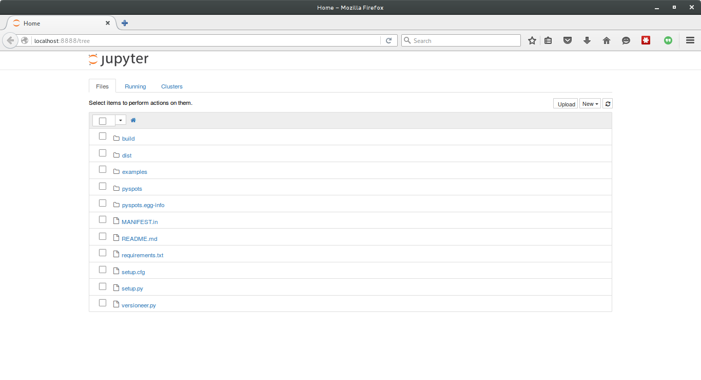
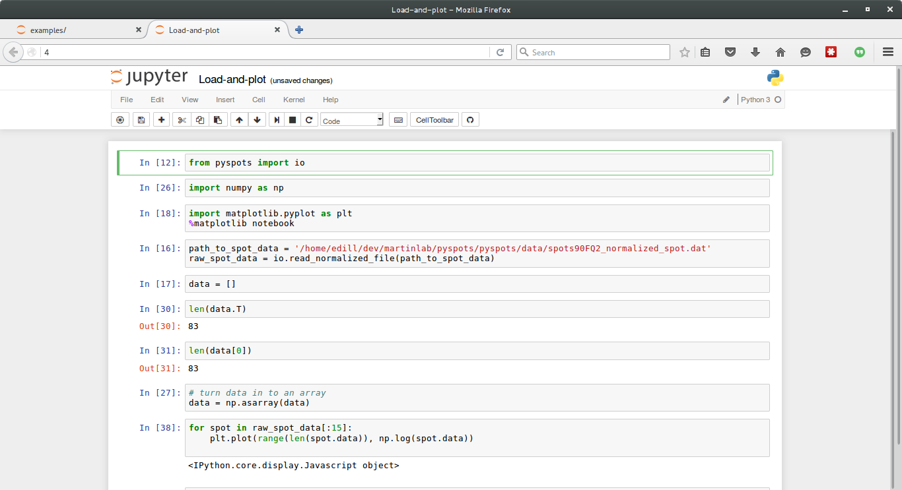

[](https://travis-ci.org/ericdill/pyspots)

# pyspots

A work in progress to extract the useful bits of the original Java
implementation of [Ramdog] (https://github.com/themartinlab/Ramdog)
and rewrite it in Python.

## Installation

If you do not have Python installed on your computer, please install python 3.5
with [Anaconda] (https://www.continuum.io/downloads).  If you have the choice,
please please please do not install python 2.

After you have installed Python, I would suggest installing a number of useful
tools for scientific python:

```
conda install jupyter numpy matplotlib --yes
conda install -c conda-forge lmfit
```

Then install pyspots:

```
pip install pyspots
```

If the above command does not work, you will need to clone the git repository
from github and install manually. Do this:

```
git clone https://github.com/themartinlab/pyspots
cd pyspots
python setup.py install
```

Then make sure it was installed
```
cd
python -c "import pyspots; print(pyramdog.__version__)"
```

If the above prints out a version number like "v0.0.1" then you have
successfully installed pyspots.  If you get an exception, please contact me
via github [here] (https://github.com/themartinlab/pyspots/issues).


## Usage

`pyspots` is meant to be used on the output files from the spotpicking
algorithms in to the Java implementation of [Ramdog]
(https://github.com/themartinlab/ramdog).

There are example jupyter notebooks that are provided with the [repository
on github] (https://github.com/ericdill/pyspots) to get your started.  First,
make sure you have jupyter and all the required dependencies installed:

```
conda install lmfit jupyter numpy -c lightsource2
```

Then, clone the repository onto your computer

```
git clone https://github.com/ericdill/pyspots
```

Note that the above command will go download the git repository to your
current directory, so make sure you are in the directory where you want to
download this git repository before you execute the command to clone the repo.

Now you are ready to open and play with these notebooks!  Navigate to the git
repository and start jupyter

```
cd pyspots
jupyter notebook
```

One of two things will happen after you execute the above command.  A browser
will pop up with the jupyter landing page, or, this web page will appear as
a tab in your already open default browser.

The page that you are looking for looks like this:



Click on 'Examples' and then 'Load-and-plot.ipynb' to launch the first
notebook.



## Setting up for Development

```
git clone https://github.com/themartinlab/pyspots
cd pyspots
python setup.py develop
```

And then run the test suite with `py.test` to make sure that it was
installed correctly.
